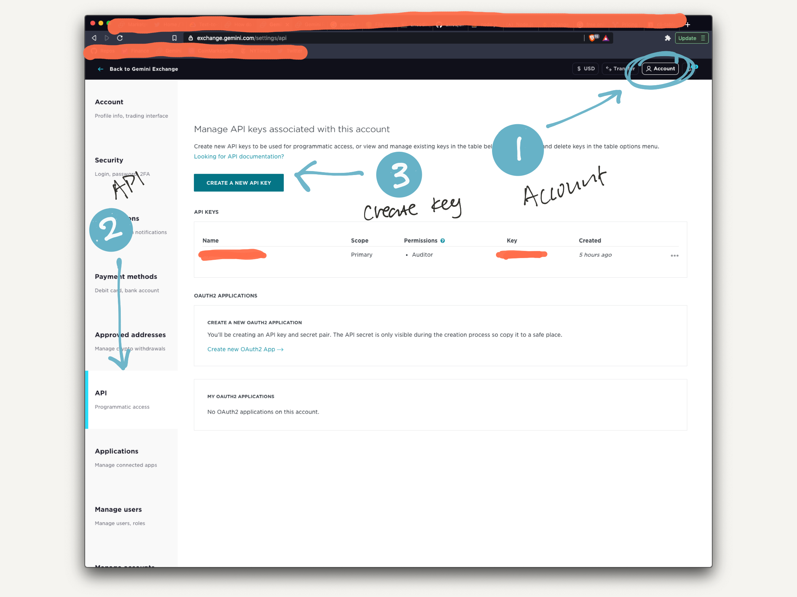
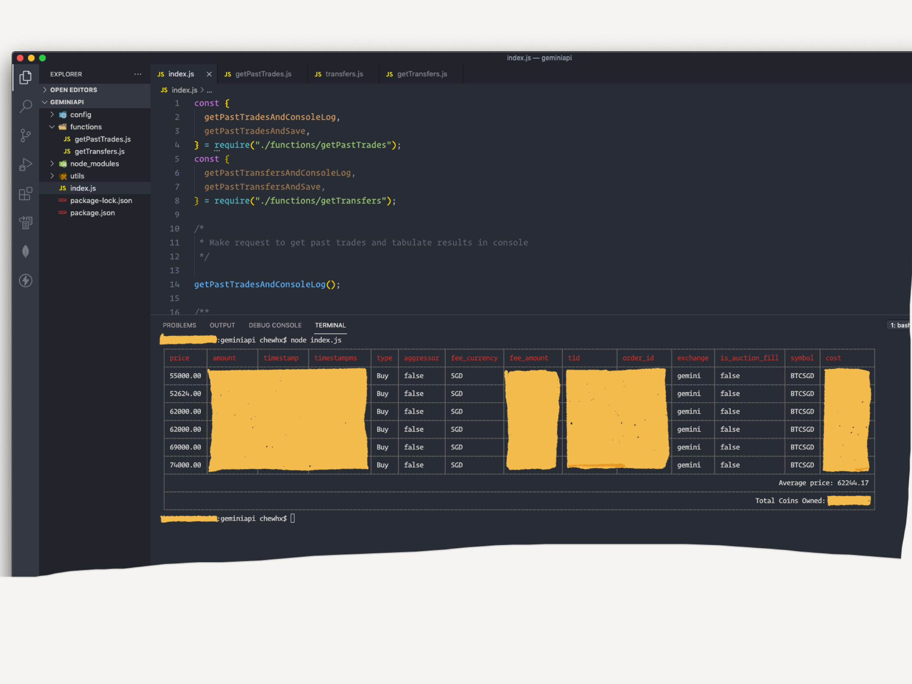
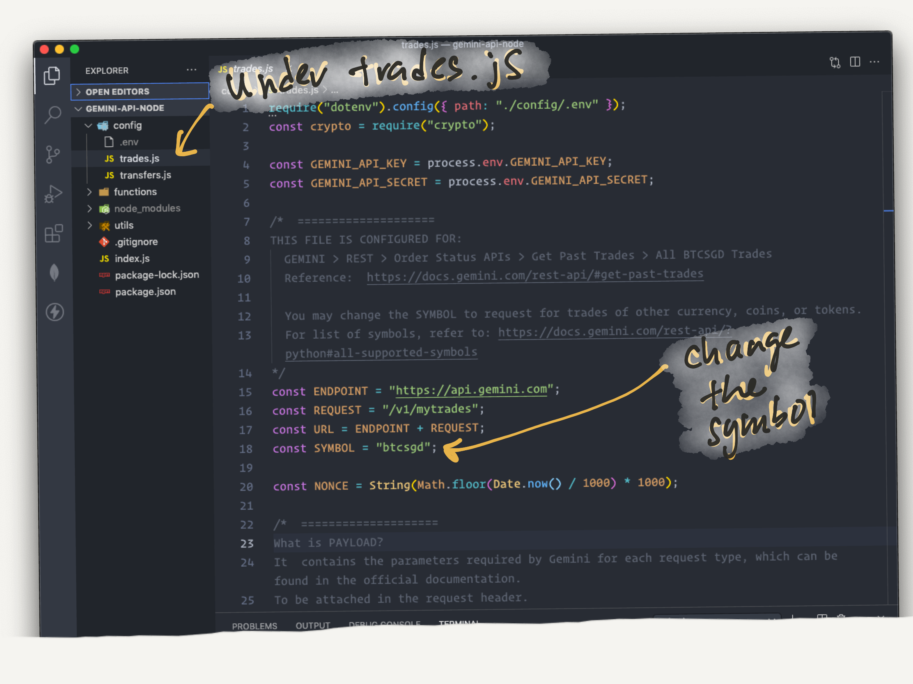

# Gemini API NodeJS

## Background

How much did I spend on Bitcoin?

Cryptocurrencies can be traded in fractional lots, so I trade by limiting a total dollar value, say $50, for each trade and purchase how ever much coins $50 gets me. Unlike stocks which are traded in fixed lots. You will always know you bought 3 shares for $600.

3 shares is easier to remember than 0.0002125434 BTC.

Adding the fact that I bought in over a range of prices for different amount of coins, I lost track of my overall portfolio position.

Cryptocurrencies are really volatile, so the hourly and daily flashing green and red portfolio do not really mean much.

The Gemini app, sadly, does not provide the information I needed to understand my position better:

- total amount spent so far on each coin or token (in terms of fiat or dollars)
- because I've bought in at different prices, I need to know what is the average price I've bought into the coins (this gives me a reference point for evaluating my current position)
  - E.g.
    - Spent $50 for $65,000/BTC; $50 for $62,000/BTC; $55 for $70,000/BTC
    - 0.0023613967 BTC for total of $155
    - Average price bought in at $65,639.12

Thankfully Gemini do provide a very generous and free developers API.

I can download all my past trades with information on fees, quantity, and the amount of fiat currency or dollars I spent.

## Roadmap:

- Other types of requests to retrieve information, like order status, or deposit addresses
- Functions to create and cancel trade orders
- Create a frontend UI to interact with the request api
- Extract all transactions and denominate in a base currency
- and...I'm open to suggestions!

## Short instructions:

- Get your api key and secret by logging into gemini
- Download the repo and instal dependecies
- Create .env and input your api key and secret
- Uncomment the functions you need
- Run `npm start` from the project root directory

## 1. Get your api key and secret from your Gemini account

Login to your account and follow the steps here:

[https://support.gemini.com/hc/en-us/articles/360031080191-How-do-I-create-an-API-key-](https://support.gemini.com/hc/en-us/articles/360031080191-How-do-I-create-an-API-key-)

Go to **Account** > **API** > **Create a new API Key** > **Copy down the API Key and the Secret**



I set the role for "Auditor" so this set of keys, which will have "READ-ONLY" access. There are more advanced requests and roles which allows you to place orders, make deposits and withdrawals via API calls.

Read more about the various roles here: [https://docs.gemini.com/rest-api/#roles](https://docs.gemini.com/rest-api/#roles)

**IMPORTANT**: Your secret key (not the api key) will only be shown once on the window and you will never be able to recover it after you exit. Make sure you copy both keys down and save them in a secure locked document ([Apple Notes](https://support.apple.com/en-sg/HT205794)) or evenly better, a digital vault / password manager ([1Password](https://1password.com)).

If you miss out on your secret key, you will have to create a new set of keys.

This goes without saying, never reveal the keys to anyone!

## 2. Download the repo and install dependencies

Repo link: [https://github.com/chewhx/gemini-api-node.git](https://github.com/chewhx/gemini-api-node.git)

I'm using NodeJS, while the official documentation has references for Python and Shell.

Download the code [here](https://github.com/chewhx/gemini-api-node.git) and run `npm install` to install the requisite packages.

Note that Gemini imposes [rate limits](https://docs.gemini.com/rest-api/#rate-limits) for the requests, at 600 calls per minute, and 5 calls per second. It's more than enough for what we need, and very generous for a free api.

Under the config folder, there are two(2) configuration files for:

1. 'Get Past Trades' - [https://docs.gemini.com/rest-api/?python#get-past-trades](https://docs.gemini.com/rest-api/?python#get-past-trades)
   - Requires you to input a symbol for the type of trade you want to retrieve. (e.g. btcusd, ethbtc)
   - Note that a "btcusd" returns only the trades which you have made in USD. It does not mean the request returns trade denominated in USD. If you have traded in other currencies, like SGD, you will need to post a "btcsgd" request for those trades.
2. '(Getting) Transfers' - [https://docs.gemini.com/rest-api/?python#transfers](https://docs.gemini.com/rest-api/?python#transfers)

Each configuration files returns unique headers to be attached to the request call:

- `"X-GEMINI-APIKEY"` - your gemini api key
- `"X-GEMINI-PAYLOAD"` - request parameters or body, encoded in base64. It works differently from other request calls which have you attach raw JSON in the request body.
- `"X-GEMINI-SIGNATURE"` - a unique signature signed with your encoded payload and gemini secret

See here to understand more: [https://docs.gemini.com/rest-api/#public-api-invocation](https://docs.gemini.com/rest-api/?python#private-api-invocation)

## 3. Create .env file in the /config folder

Reference: [https://www.npmjs.com/package/dotenv](https://www.npmjs.com/package/dotenv)

You may do so either by:

- terminal command `cd config && touch .env` or
- right-click in your code editor file panel > create a new file > name it `.env`

In the `.env` file add your api key and secret. Stick to the variable naming below, unless you will be making your own edits to the config files.

```jsx
GEMINI_API_KEY = th1s1sn0tmykeyd3m0only;
GEMINI_API_SECRET = th1s1sn0tmys3cr3td3m0only;
```

## 4. Make a POST request

Reference: [https://docs.gemini.com/rest-api/](https://docs.gemini.com/rest-api/)

The following functions are presented in `/index.js`.

You should uncomment those you do not wish to execute.

To run the functions, execute `npm start` in your terminal.



- `getPastTradesAndConsoleLog()`

Makes a request to recover all trade history and present in the terminal as table. Your total coin asset owned and average trading price is also calculated.\*

- `getPastTradesAndSave()`

Makes a request to recover all trade history and save as JSON file in the root directory of the project.\*

\*The default symbol is "btcsgd". You may change it under `trades.js` in config folder.



- `getPastTransfersAndConsoleLog()`

Makes a request to recover all transfers history and present in the terminal as table

- `getPastTransfersAndSave()`

Makes a request to recover all transfers history and save as JSON file in the root directory of the project

## References

- HMAC - [https://stackoverflow.com/questions/39892167/node-hmac-authentication](https://stackoverflow.com/questions/39892167/node-hmac-authentication)
- Base64 encoding - [https://stackabuse.com/encoding-and-decoding-base64-strings-in-node-js/](https://stackabuse.com/encoding-and-decoding-base64-strings-in-node-js/)
- JS DateTime for nonce - [https://stackoverflow.com/questions/3830244/get-current-date-time-in-seconds](https://stackoverflow.com/questions/3830244/get-current-date-time-in-seconds)
- Gemini API - [https://docs.gemini.com/rest-api](https://docs.gemini.com/rest-api)
- CLI Table - [https://github.com/cli-table/cli-table3](https://github.com/cli-table/cli-table3)
- dotenv - [https://www.npmjs.com/package/dotenv](https://www.npmjs.com/package/dotenv)
- axios for http request - [https://github.com/axios/axios](https://github.com/axios/axios)
